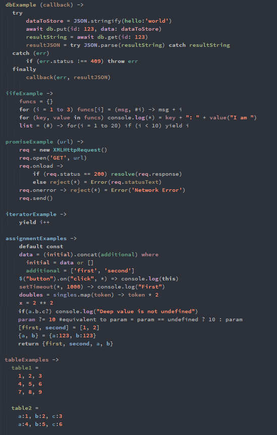

# Introducing Prescript
Prescript is a framework for running macros over code that will eventually become javascript. It includes a number of beautiful macros out of the box.

**[View an example of code written with the out-of-the-box PreScript Macro's here.](demo/input/example.pre.coffee)**. 

Prescript does its best not to touch any code that does not explicitly match a defined macro pattern. This way it works well with other languages and transpilers, including Babel.js. All valid javascript, Typescript, and JSX should work with Prescript without modification in Prescript. When you decide you want to make use of a Prescript macro, just start using it - you don't need to make any bold efforts to learn learn and transition to a new language.



### Bracket free block and automatic semi-colon insertion
Whitespace defined blocks are wrapped in curly brackets `{}` if they were left out. The result is that the code looks a little Python, Ruby, or well written Coffeescript, if you want it to.

### IIFE generation
Functions declarations containing variables marked with a `#` will be automatically wrapped in an IIFE ensuring a closure is created around the `#` marked parameters. Eg  `fn = (intParam, #extParam) -> body`. Simple IIFEs can also be generated using the `(#) -> doImmediatley()` syntax. Simple generator IIFEs will automatically flush to an array Eg. `(#) -> for(x = 0 to 10) yield x`.

### Automatic function prefix creation and promise function shorthand
The words `generator` and `async` will automatically be included as a prefixes to function declarations where the keywords `yield` and `await` are found within a function body. This feature also allows you to notionaly use arrow function syntax while creating async and generator functions. Functions defined using the tilde-arrow `~>` will automatically be wrapped in a `new Promise(body)`. eg.`get (url) ~> if(true) resolve(data) else reject("Error")`

### Hoisted arrow functions, function assignment shorthand, and skinny arrows
Skinny arrow functions are standard functions. They will become function declarations instead of function expressions where assigned to a variable name in the current scope. As function declarations they benefit from function hoisting. Eg. `hoistedFn = (params) -> fnBody`. Use of the equals sign during function definition and assignment is optional. Eg. `obj.prop -> fnBody`. Shorthand can also be used when passing an anonymous function as an argument during function invocation Eg. `doubles = singles.map(token) -> token * 2`.

### Postfix scope blocks using asterix and where
Code blocks to be run immediatley before an assignment or function invocation can be defined after the assignment or function invocation. Eg.  `x = add(a, 10) where a = multiply(3,7)`. The asterix character when combined with equals sign provides a simpler anonymous form of this Eg.  `console.log(*) = "Hello World"`

### Automatic variable declaration
Variables can be set to automatically be defined within the scope that they are first used, using either var, let, or const. This can be configured to only apply to variables defined in loop declarations and catch statements. It is recommended to use semantic-colouring in your IDE if you have this feature enabled for cover all variables. Eg. `default const`

### Block bounded multi-line array definition
Tables of data can be defined using a shorthand syntax by defining a block during an assignment (`=`). Each line within the block not ending in a comma is considered a new element of a parent array. Lists's of dictionaries can be created using this syntax too  eg.

```
let table1  = 
    "A1", "B1", "C1"
    "A2", "B2", "C2"
    
let table2 = 
    a:1, b:1, c:1
    a:2, b:2, c:2
```

### Inline try/catch
Allows individual expressions to be easily wrapped in a try/catch statement with the catch returning a default value. Eg. `try JSON.parse(string) catch {error: 'poorly formed json'}`

### Bracket free object literals
Lists of colon delimited pairs are wrapped in curly brackets `{}` when used in direct assignment or when wrapped in curved brackets `()`. Eg. `dict = a:b, c:d, e:f` or `fn(a:b, c:d)`

### Existensial check and conditional assignment
Deep properties of an object can be extracted without fear of `cannot read property of undefined` by placing a single question mark at the end of a property list. eg. `a.b.c.d?`. A new `?=` operator sets variables to a value only if that variable is not currently `undefined` Eg. `myArg ?= 10`.

### Basic Macro / DSL support
Macros and string template tags with user defined token delineators can be defined with the result looking like Eg. `db.add(graph :: a <-> b <-> c). Check [here](demo/input/example.pre.coffee) for more examples.

### For-in conversion to capture both key and value and for loop support for 'to' keywprd
For-in loops can be defined to extract both key and value at the same time by providing a second variable name when the loop is declared. This feature exists to reduce confusion between for-of and for-in. Eg. `for (key, value in dict)`. The `to` keyword can be used to define standard for loops. Eg. `for (x = 0 to array.length)`

### Result chaining
The result of one expression can be automatically passed to another expression by combining the `>>` operator and asterix `*` characters. eg. `score = await db.get(input) >> JSON.parse(*) >> parseInt(*.value) / 100`

### Optional flow and typescript compatible types
Types can be defined just like in typescript or flow Eg. `type callback = (error:boolean, result:string) => void`.

Prescript is pre-alpha and not ready for usage in any context. Pull requests and other contributions welcome.
